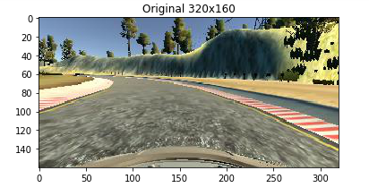
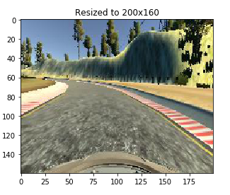
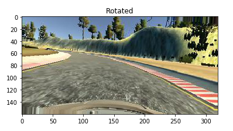
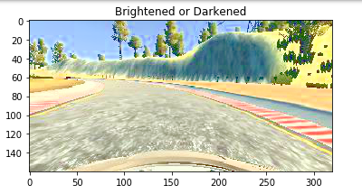
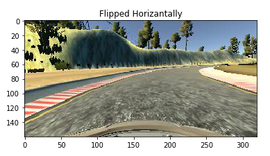
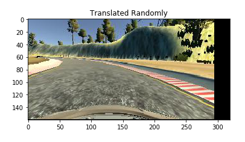
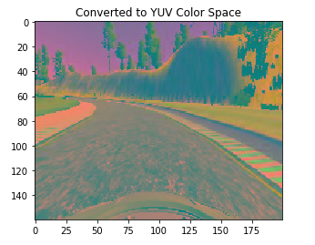
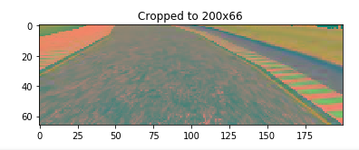

# **Project Behavioral Cloning** 


###### The goal of this project was to teach a virtual car to drive around a virtual track. A neural network was trained with image data taken from a camera mounted on the car and the steering angles data for each image. The car was first driven by human input and the data produced was used to train the neural network in order to make it mimic human driving behaviour 


---

**Goals of the project**
The goal of the project was to clone the behavior of a human driver with the help of neural network and predict steering angles as the car drives 

**Steps**
1.  The simulator was used to collect good driving behaviour
2.  A convolutional neural netword based on NVIDIA's architecture was build
3.  Data collected was augmented and the model was trained by using the generated data 
4.  Test that the model successfully drives around track one without leaving the road


[//]: # (Image References)

[image1]: ./examples/placeholder.png "Model Visualization"
[image2]: ./examples/placeholder.png "Grayscaling"
[image3]: ./examples/placeholder_small.png "Recovery Image"
[image4]: ./examples/placeholder_small.png "Recovery Image"
[image5]: ./examples/placeholder_small.png "Recovery Image"
[image6]: ./examples/placeholder_small.png "Normal Image"
[image7]: ./examples/placeholder_small.png "Flipped Image"

---

#### Submitted Files: 

My project includes the following files:
1. model.py containing the script to create and train the model
2. drive.py for driving the car in autonomous mode
3. model.h5 containing a trained convolution neural network 
4. writeup_report.md or writeup_report.pdf summarizing the results
5. video

#### Steps to run the model
1 . Open terminal and run this command 
```sh
python drive.py model.h5
```
2 . Open the simulator provided by udacity and go to autonomous mode to test the model


## Model Architecture and Training Strategy

##### 1. Model Architecture

The model used in this project is based on the paper published by NVIDIA which tackles the same problem of predicting steering angles based on the images captured by a camera mounted on the car. The model consists of 5 convolutional layers followed by three fully connected layers which output to a single neuron which predicts the steering angle. At first a modified LeNet architecture was used which was able to predict the steering angles correctly on Track 1 and most of Track 2. The NVIDIA architecture was later chosen because it has been proven to work in real world. 

##### 2. Collecting the training data:
In order to collect the data to train the network Udacity's simulator was used. The car in the simulator has three cameras mounted on it, one in the centre of the car above the hood and two cameras on each side of the car. The car was driven on the tracks provided on the simulator and images and steering data were recorded. 

 - **Collection Strategy**
    - Few laps while driving the car in the middle of the track in both clockwise and          anti-clockwise directions. 
    - Recovery laps where the car was made to be about to leave the track and data was         only recorded only while bringing the car back to middle of the road in order to         teach the car to steer back to the middle of the road.
    - Data was colleted on Track 2 also inorder to generalise the model better. 
    - At places where the car could not see the road ahead like on uphill portions the car was trained to go straight down the middle of the road. 
 
##### 3. Preprocessing and Augmenting the training data
 - **Preprocessing**
    - The images captured were of dimension 160 pixels wide and 320 pixels high. The           images were resized to 160 x 200 and then the image was croppped to dimensions 66 x       200. Bottom 25 pixels were cropped to remove the hood of the car and top 69 pixels       were cropped to remove the trees and sky and other unimportant stuff in background       leaving only the road. The steering angles were adjusted for left and right images.
 - **Generating Additional Data**
    The following augmentation techniques were used 
    -  Brightening : The image was brightened or darkened randomly 
    -  Rotating : The image was randomly rotated by a small but significant angle 
    -  Translating : The image was randomly translated along one or both axis
    -  Adding Random Shadows : Shadows were randomly added to the training images
    -  Flipping : Images were flipped horizantly and steering angle was adjusted                           accordingly.
 - **Technique used to  genrate augmented data**
  Since there were a lot of training images it was not possible to keep all the images      in memory, so generator was used.  
   1. The training data has a bias towards having a steering angle of 0. So inorder to remove this bias samples are randomly dropped from the training data where the steering angle is 0 with a probability of keeping the data of 0.3 
   2. The training data is first shuffled 
   3. Then the data is then looped over by choosing 24 times the outputted batch size and       these images are read from the disk and augmented randomly with a bias towards flipping the image and then shuffled and then 128 images are outputted from this pool of augmented data in order to introduce further randomness in the set of augmented images
   4. The number of batches that can be genrated from this technique is calculated.
   
- **Training and Validation Split**
    - The data captured from the simulator was split into training(80&) and validation(20%) sets. This was done after the number of pictures with steering angle = 0 was lowered.
 










##### 4. Training the model
Adam optimizer was used to train the model with a learnrate 0.001. Dropout layers were added to the model during training  to reduce overfitting. L2 regularization was added to the fully connected layers but it didnt show any significant improvement. The model was trained on the augmented set 667 batches with each batch comprising of 128 images each and fit_generator function of keras was used to accomplish the task. After training the model was saved. 

___
## **Results**
The train model was correctly able to predict the steering angles on Track 1 and on most of the Track 2 except the really sharp turns where it goes off the road. It is able to smoothly control the car at uphill portions of the track where it cannot see the road properly. 

---
### References
1. [An augmentation based deep neural network approach to learn human driving behavior](https://chatbotslife.com/using-augmentation-to-mimic-human-driving-496b569760a9)
2. [Stack Overflow](http://stackoverflow.com/)
3. [Building powerful image classification models using very little data](https://blog.keras.io/building-powerful-image-classification-models-using-very-little-data.html)
4. [End-to-End Deep Learning for Self-Driving Cars](https://devblogs.nvidia.com/parallelforall/deep-learning-self-driving-cars/)


